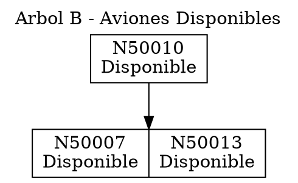

# MANUAL TÉCNICO
## Sistema de Gestión de Aeropuerto

**Universidad de San Carlos de Guatemala**  
**Facultad de Ingeniería**  
**Escuela de Ciencias y Sistemas**  
**Estructuras de Datos**

---

**Estudiante:** Christian Javier Rivas Arreaga
**Carné:** 202303204  
**Fecha:** Diciembre 2025

---

## 📋 Tabla de Contenidos

1. [Introducción](#introducción)
2. [Requerimientos del Sistema](#requerimientos-del-sistema)
3. [Arquitectura del Sistema](#arquitectura-del-sistema)
4. [Estructuras de Datos Implementadas](#estructuras-de-datos-implementadas)
5. [Modelos de Datos](#modelos-de-datos)
6. [Controladores](#controladores)
7. [Algoritmos Principales](#algoritmos-principales)
8. [Formato de Archivos de Entrada](#formato-de-archivos-de-entrada)
9. [Compilación y Ejecución](#compilación-y-ejecución)
10. [Generación de Reportes](#generación-de-reportes)
11. [Gestión de Memoria](#gestión-de-memoria)
12. [Casos de Uso](#casos-de-uso)

---

## 1. Introducción

### 1.1 Objetivo del Proyecto

Implementar un sistema de gestión aeroportuaria que permite administrar aviones, pilotos, rutas y asignaciones de vuelos utilizando estructuras de datos avanzadas.

### 1.2 Alcance

El sistema permite:
- Gestionar aviones disponibles y en mantenimiento
- Registrar y administrar pilotos por horas de vuelo y ID
- Definir rutas entre ciudades
- Calcular rutas óptimas usando algoritmo de Dijkstra
- Asignar vuelos a pilotos
- Generar reportes visuales con Graphviz

---

## 2. Requerimientos del Sistema

### 2.1 Requerimientos de Hardware

- **Procesador:** Intel Core i3 o superior
- **Memoria RAM:** 4 GB mínimo (8 GB recomendado)
- **Espacio en Disco:** 500 MB libres
- **Pantalla:** Resolución mínima 1024x768

### 2.2 Requerimientos de Software

#### Sistema Operativo
- Windows 10/11
- Linux (Ubuntu 20.04 o superior)
- macOS 10.15 o superior

#### Herramientas de Desarrollo
- **Compilador C++:** 
  - GCC 9.0+ (con soporte C++17)
  - MinGW-w64 (Windows)
  - Clang 10.0+ (opcional)

#### Dependencias Externas
- **Graphviz 2.44+**: Para generación de reportes visuales
  - Windows: Descargar desde https://graphviz.org/download/
  - Linux: `sudo apt-get install graphviz`
  - macOS: `brew install graphviz`

- **nlohmann/json**: Librería para parseo de JSON (incluida en el proyecto)

### 2.3 Instalación de Dependencias

#### Windows
```bash
# Instalar MinGW-w64
# Descargar desde: https://sourceforge.net/projects/mingw-w64/

# Instalar Graphviz
# Descargar instalador desde: https://graphviz.org/download/
# Agregar al PATH: C:\Program Files\Graphviz\bin
```

#### Linux (Ubuntu/Debian)
```bash
sudo apt-get update
sudo apt-get install g++ graphviz
```

#### macOS
```bash
brew install gcc graphviz
```

---

## 3. Arquitectura del Sistema

### 3.1 Estructura de Directorios

```
202303204_EDD_Proyecto/
│
├── src/
│   ├── main.cpp                    # Punto de entrada
│   │
│   ├── controllers/                # Controladores
│   │   ├── AvionController.h
│   │   ├── PilotoController.h
│   │   ├── RutaController.h
│   │   ├── MatrizController.h
│   │   └── ComandosController.h
│   │
│   ├── models/                     # Modelos de datos
│   │   ├── Avion.h
│   │   ├── Piloto.h
│   │   └── Ruta.h
│   │
│   ├── estructuras/                # Estructuras de datos
│   │   ├── ArbolB.h
│   │   ├── ArbolAVL.h
│   │   ├── TablaHash.h
│   │   ├── ListaCircularDoble.h
│   │   ├── Grafo.h
│   │   ├── MatrizDispersa.h
│   │   └── Nodo.h
│   │
│   └── json/                       # Librería JSON
│       └── json.hpp
│
├── data/                           # Archivos de entrada
│   ├── aviones.json
│   ├── pilotos.json
│   ├── rutas.txt
│   └── comandos.txt
│
├── reports/                        # Reportes generados
│   ├── arbolB_disponibles.dot
│   ├── arbolB_disponibles.png
│   ├── arbolAVL_pilotos.dot
│   ├── arbolAVL_pilotos.png
│   ├── tablaHash_pilotos.dot
│   ├── tablaHash_pilotos.png
│   ├── lista_mantenimiento.dot
│   ├── lista_mantenimiento.png
│   ├── grafo_rutas.dot
│   ├── grafo_rutas.png
│   ├── matriz_dispersa.dot
│   └── matriz_dispersa.png
│
├── Manual_Tecnico.pdf              # Este documento
└── README.md                       # Documentación básica
```

### 3.2 Diagrama de Componentes

```
┌─────────────────────────────────────────────────────────┐
│                      MAIN.CPP                           │
│                   (Menú Principal)                      │
└──────────────┬──────────────────────────────────────────┘
               │
               ├─── AvionController ──┬─── ArbolB
               │                      └─── ListaCircularDoble
               │
               ├─── PilotoController ─┬─── ArbolAVL
               │                      └─── TablaHash
               │
               ├─── RutaController ───┴─── Grafo (Dijkstra)
               │
               ├─── MatrizController ─┴─── MatrizDispersa
               │
               └─── ComandosController (Coordina todos)
```

---

## 4. Estructuras de Datos Implementadas

### 4.1 Árbol B (Orden 5)

#### Descripción
Árbol balanceado multinodo que almacena aviones **disponibles** usando el número de registro como llave.

#### Características
- **Orden:** 5 (máximo 4 claves por nodo)
- **Llave:** Número de registro (ej: N50001)
- **Operaciones:** O(log n)

#### Implementación Clave
```cpp
template <typename T>
class ArbolB {
private:
    NodoB<T> *raiz;
    int orden;
    
    void dividirHijo(NodoB<T> *padre, int i, NodoB<T> *hijo);
    void insertarNoLleno(NodoB<T> *nodo, T *dato);
    
public:
    ArbolB(int orden);
    void insertar(T *dato);
    T *buscar(string numeroRegistro);
    T *extraer(string numeroRegistro);
};
```

#### Complejidad
| Operación | Complejidad |
|-----------|-------------|
| Inserción | O(log n) |
| Búsqueda | O(log n) |
| Eliminación | O(log n) |

---

### 4.2 Lista Circular Doble

#### Descripción
Lista doblemente enlazada circular que almacena aviones en **mantenimiento**.

#### Características
- **Circularidad:** El último nodo apunta al primero
- **Doble enlace:** Cada nodo tiene punteros `anterior` y `siguiente`
- **Identificador:** Número de registro

#### Implementación Clave
```cpp
template <typename T>
class ListaCircularDoble {
private:
    Nodo<T> *primero;
    Nodo<T> *ultimo;
    
public:
    void insertar(T *dato);
    T *extraer(string identificador);
    bool eliminar(string identificador);
    void mostrar();
};
```

#### Estructura
```
primero → [N50002] ⇄ [N50003] ⇄ [N50004] ⇄ ... ⇄ [N50030] → primero
              ↑                                        ↓
              └────────────────────────────────────────┘
```

---

### 4.3 Árbol AVL

#### Descripción
Árbol binario de búsqueda auto-balanceado que almacena pilotos ordenados por **horas de vuelo**.

#### Características
- **Ordenamiento:** Por horas de vuelo (ascendente)
- **Balanceo:** Factor de balance ∈ {-1, 0, 1}
- **Rotaciones:** Simple y doble (4 casos)

#### Implementación Clave
```cpp
template <typename T>
class ArbolAVL {
private:
    NodoAVL<T> *raiz;
    
    int obtenerAltura(NodoAVL<T> *nodo);
    int obtenerBalance(NodoAVL<T> *nodo);
    NodoAVL<T> *rotacionDerecha(NodoAVL<T> *y);
    NodoAVL<T> *rotacionIzquierda(NodoAVL<T> *x);
    
public:
    void insertar(T *dato);
    T *eliminar(int horasVuelo, const string &id);
    void preorden();
    void inorden();
    void postorden();
};
```

#### Rotaciones
```
Rotación Derecha:            Rotación Izquierda:
     y                            x
    / \         →                / \
   x   C                        A   y
  / \                              / \
 A   B                            B   C
```

---

### 4.4 Tabla Hash

#### Descripción
Tabla hash con **manejo de colisiones por encadenamiento** que almacena pilotos indexados por ID.

#### Características
- **Capacidad:** M = 19
- **Función Hash:** `h(k) = Σ(dígitos) mod 19`
- **Colisiones:** Encadenamiento (listas enlazadas)

#### Implementación de la Función Hash
```cpp
int funcionHash(string id) {
    int suma = 0;
    for (char c : id) {
        if (isdigit(c)) {
            suma += (c - '0');  // Suma cada dígito
        }
    }
    return suma % capacidad;
}
```

#### Ejemplo
```
ID: P12345678
Suma: 1+2+3+4+5+6+7+8 = 36
Hash: 36 % 19 = 17
Índice: 17
```

#### Manejo de Colisiones
```
[1] → P11223344 → P44332211  (ambos suman 20)
[3] → P99887766
[6] → P98765432
```

---

### 4.5 Grafo Dirigido

#### Descripción
Grafo dirigido implementado con **listas de adyacencia** que representa rutas entre ciudades.

#### Características
- **Representación:** Listas de adyacencia
- **Pesos:** Distancias en kilómetros
- **Algoritmo:** Dijkstra para ruta más corta

#### Implementación
```cpp
class Grafo {
private:
    NodoGrafo *vertices;  // Lista de vértices
    
    class NodoGrafo {
        string ciudad;
        Arista *adyacentes;  // Lista de adyacencia
    };
    
    class Arista {
        string destino;
        int peso;
        Arista *siguiente;
    };
    
public:
    void agregarRuta(string origen, string destino, int distancia);
    void rutaMasCorta(string origen, string destino);
};
```

#### Algoritmo de Dijkstra
```cpp
void rutaMasCorta(string origen, string destino) {
    // 1. Inicializar distancias a infinito
    map<string, int> dist;
    map<string, string> prev;
    
    // 2. Min-heap para seleccionar vértice de menor distancia
    priority_queue<Par, vector<Par>, greater<Par>> pq;
    
    // 3. Relajación de aristas
    while (!pq.empty()) {
        auto [d, ciudad] = pq.top();
        pq.pop();
        
        // Procesar adyacentes...
    }
    
    // 4. Reconstruir camino
}
```

---

### 4.6 Matriz Dispersa

#### Descripción
Matriz dispersa con **estructura ortogonal** que relaciona vuelos, ciudades y pilotos.

#### Características
- **Filas:** Vuelos (A100, A102, A103...)
- **Columnas:** Ciudades (Guatemala, Mexico, Miami...)
- **Datos:** ID de Pilotos (P12345678...)
- **Enlaces:** Ortogonales en 4 direcciones

#### Estructura de Nodos
```cpp
class NodoMatriz {
public:
    int x, y;           // Coordenadas
    string dato;        // ID del piloto
    NodoMatriz *arriba, *abajo, *izquierda, *derecha;
};
```

#### Representación Visual
```
         Matriz
        /      \
     Raíz   →  Guatemala → Mexico → Miami
      ↓          ↓          ↓         ↓
    A100   →  P12345678
      ↓
    A102               →  P98765432
      ↓
    A103                            → P11223344
```

#### Operaciones Clave
```cpp
void insertar(string idPiloto, string vuelo, string ciudad);
void eliminarPiloto(string idPiloto);
void eliminarCabeceraHuerfana(string nombre);
```

---

## 5. Modelos de Datos

### 5.1 Avión

#### Atributos
```cpp
class Avion {
private:
    string vuelo;               // Número de vuelo (ej: A100)
    string numero_de_registro;  // Identificador único (ej: N50001)
    string modelo;              // Modelo del avión
    string fabricante;          // Boeing, Airbus, etc.
    int ano_fabricacion;
    int capacidad;              // Número de pasajeros
    int peso_max_despegue;      // En kilogramos
    string aerolinea;
    string estado;              // "Disponible" o "Mantenimiento"
};
```

#### Métodos Principales
- `getNumeroDeRegistro()`: Identificador único
- `getEstado()`: Estado actual
- `setEstado(string)`: Cambiar estado
- `mostrar()`: Imprimir información

---

### 5.2 Piloto

#### Atributos
```cpp
class Piloto {
private:
    string id;              // ID único (ej: P12345678)
    string nombre;
    string apellido;
    string nacionalidad;
    int horasVuelo;         // Horas de vuelo acumuladas
    string estado;          // "Disponible"
};
```

#### Métodos Principales
- `getId()`: Identificador único
- `getHorasVuelo()`: Para ordenamiento en AVL
- `mostrar()`: Imprimir información

---

### 5.3 Ruta

#### Atributos
```cpp
class Ruta {
private:
    string origen;
    string destino;
    int distancia;  // En kilómetros
};
```

---

## 6. Controladores

### 6.1 AvionController

#### Responsabilidades
- Gestionar árbol B de aviones disponibles
- Gestionar lista circular de aviones en mantenimiento
- Mover aviones entre estructuras
- Generar reportes

#### Métodos Principales
```cpp
void cargarDesdeJSON(string rutaArchivo);
void moverAvion(string numeroRegistro, string nuevoEstado);
void reporteDisponibles();
void reporteMantenimiento();
```

---

### 6.2 PilotoController

#### Responsabilidades
- Gestionar árbol AVL de pilotos (por horas)
- Gestionar tabla hash de pilotos (por ID)
- Dar de baja pilotos
- Generar reportes y recorridos

#### Métodos Principales
```cpp
void cargarDesdeJSON(string rutaArchivo);
Piloto *buscarPorID(string id);
void darDeBaja(string id);
void recorridoPreorden();
void recorridoInorden();
void recorridoPostorden();
```

---

### 6.3 RutaController

#### Responsabilidades
- Gestionar grafo de rutas
- Calcular ruta más corta (Dijkstra)
- Generar reporte del grafo

#### Métodos Principales
```cpp
void cargarDesdeArchivo(string rutaArchivo);
void calcularRutaMasCorta(string origen, string destino);
void reporteGrafo();
```

---

### 6.4 MatrizController

#### Responsabilidades
- Gestionar matriz dispersa
- Asignar vuelos a pilotos
- Eliminar pilotos de la matriz
- Generar reporte

#### Métodos Principales
```cpp
void asignarVuelo(string idPiloto, string numeroVuelo, string ciudad);
void eliminarPilotoDeMatriz(string idPiloto);
void reporteMatriz();
```

---

### 6.5 ComandosController

#### Responsabilidades
- Procesar archivo de comandos
- Coordinar operaciones entre controladores

#### Comandos Soportados
1. `MantenimientoAviones,<Estado>,<NumRegistro>;`
   - Estados: `Ingreso` (→ Mantenimiento), `Salida` (→ Disponible)
   
2. `AsignarVuelo,<IDPiloto>,<NumVuelo>,<Ciudad>;`
   
3. `DarDeBaja(<IDPiloto>);`

---

## 7. Algoritmos Principales

### 7.1 Algoritmo de Dijkstra

#### Descripción
Encuentra la ruta más corta entre dos ciudades en el grafo de rutas.

#### Complejidad
- **Temporal:** O((V + E) log V) usando min-heap
- **Espacial:** O(V)

#### Pseudocódigo
```
función dijkstra(origen, destino):
    dist[v] ← ∞ para todo vértice v
    dist[origen] ← 0
    prev[v] ← null
    
    cola_prioridad ← {(0, origen)}
    
    mientras cola_prioridad no esté vacía:
        (d, u) ← extraer_min(cola_prioridad)
        
        si u == destino:
            break
        
        para cada vecino v de u:
            distancia_nueva ← d + peso(u, v)
            
            si distancia_nueva < dist[v]:
                dist[v] ← distancia_nueva
                prev[v] ← u
                insertar(cola_prioridad, (distancia_nueva, v))
    
    reconstruir_camino(prev, origen, destino)
```

---

### 7.2 Balanceo AVL

#### Casos de Rotación

**Caso 1: Izquierda-Izquierda (LL)**
```
Antes:        Después:
   z             y
  /             / \
 y       →     x   z
/
x
```
**Solución:** Rotación simple derecha

**Caso 2: Derecha-Derecha (RR)**
```
Antes:        Después:
x               y
 \             / \
  y     →     x   z
   \
    z
```
**Solución:** Rotación simple izquierda

**Caso 3: Izquierda-Derecha (LR)**
```
Antes:           Después:
   z                y
  /                / \
 x        →       x   z
  \
   y
```
**Solución:** Rotación izquierda en x, luego rotación derecha en z

**Caso 4: Derecha-Izquierda (RL)**
```
Antes:           Después:
x                  y
 \                / \
  z      →       x   z
 /
y
```
**Solución:** Rotación derecha en z, luego rotación izquierda en x

---

## 8. Formato de Archivos de Entrada

### 8.1 aviones.json

```json
[
    {
        "vuelo": "A100",
        "numero_de_registro": "N50001",
        "modelo": "Boeing 737",
        "fabricante": "Boeing",
        "ano_fabricacion": 2015,
        "capacidad": 180,
        "peso_max_despegue": 79000,
        "aerolinea": "AirlineX",
        "estado": "Disponible"
    }
]
```

### 8.2 pilotos.json

```json
[
    {
        "nombre": "Carlos",
        "apellido": "Rodriguez",
        "nacionalidad": "Guatemala",
        "numero_de_id": "P12345678",
        "vuelo": "A100",
        "horas_de_vuelo": 5000,
        "tipo_de_licencia": "CPL",
        "estado": "Disponible"
    }
]
```

### 8.3 rutas.txt

```
Guatemala/Mexico/1200;
Mexico/Miami/2100;
Miami/NewYork/1750;
```

**Formato:** `Origen/Destino/Distancia;`

### 8.4 comandos.txt

```
MantenimientoAviones,Salida,N50001;
AsignarVuelo,P12345678,A100,Guatemala;
DarDeBaja(P22334455);
```

---

## 9. Compilación y Ejecución

### 9.1 Compilación

#### Windows (MinGW)
```bash
cd src
g++ -o aeropuerto.exe main.cpp -std=c++17 -I. -O2
```

#### Linux/macOS
```bash
cd src
g++ -o aeropuerto main.cpp -std=c++17 -I. -O2
```

### 9.2 Ejecución

#### Windows
```bash
aeropuerto.exe
```

#### Linux/macOS
```bash
./aeropuerto
```

### 9.3 Estructura del Menú

```
=====================================================================
               FACULTAD DE INGENIERIA
                ESTRUCTURAS DE DATOS
                Carne: 202303204
=====================================================================
         SISTEMA DE GESTION DE AEROPUERTO - PROYECTO
=====================================================================
  1. Cargar Aviones
  2. Cargar Pilotos
  3. Cargar Rutas
  4. Cargar Movimientos
  5. Consulta de Horas de Vuelo (Pilotos)
  6. Recomendar Ruta
  7. Visualizar Reportes (generar todos)
  8. Salir
=====================================================================
```

---

## 10. Generación de Reportes

### 10.1 Proceso de Generación

1. **Crear archivo .dot** con formato Graphviz
2. **Ejecutar comando:** `dot -Tpng archivo.dot -o archivo.png`
3. **Abrir automáticamente** el PNG generado

### 10.2 Reportes Disponibles

| Reporte | Archivo | Descripción |
|---------|---------|-------------|
| Árbol B | `arbolB_disponibles.png` | Aviones disponibles |
| Lista Circular | `lista_mantenimiento.png` | Aviones en mantenimiento |
| Árbol AVL | `arbolAVL_pilotos.png` | Pilotos por horas |
| Tabla Hash | `tablaHash_pilotos.png` | Pilotos por ID |
| Grafo | `grafo_rutas.png` | Rutas entre ciudades |
| Matriz | `matriz_dispersa.png` | Asignaciones |

### 10.3 Ejemplo de Archivo DOT (Árbol B)



---

## 11. Gestión de Memoria

### 11.1 Principios

1. **Ownership claro:** Cada estructura es dueña de sus nodos
2. **Evitar double-free:** Usar métodos `extraer()` que retornan punteros sin liberar
3. **Copias cuando necesario:** Tabla Hash crea copias de pilotos

### 11.2 Movimiento de Datos

#### Ejemplo: Mover Avión entre Estructuras

```cpp
// AvionController::moverAvion()
Avion *avion = listaMantenimiento->extraer(numeroRegistro);
if (avion != nullptr) {
    avion->setEstado("Disponible");
    arbolDisponibles->insertar(avion);  // Árbol toma ownership
}
```

**Nota:** `extraer()` retorna el puntero sin liberar memoria, permitiendo mover el dato entre estructuras.

### 11.3 Destructores

Cada estructura implementa destructores que liberan:
- Los nodos de la estructura
- Los datos almacenados en los nodos

```cpp
~ArbolB() {
    eliminarRecursivo(raiz);  // Libera nodos y datos
}

~ListaCircularDoble() {
    // Recorrer y liberar cada nodo
}
```

---

## 12. Casos de Uso

### 12.1 Caso de Uso 1: Cargar y Visualizar Aviones

**Flujo:**
1. Usuario selecciona opción 1 (Cargar Aviones)
2. Sistema carga `aviones.json`
3. Separa aviones por estado:
   - Disponibles → Árbol B
   - Mantenimiento → Lista Circular
4. Usuario selecciona opción 7 (Visualizar Reportes)
5. Sistema genera y abre:
   - `arbolB_disponibles.png`
   - `lista_mantenimiento.png`

**Resultado:** Visualización de las estructuras con todos los aviones

---

### 12.2 Caso de Uso 2: Mover Avión a Mantenimiento

**Archivo comandos.txt:**
```
MantenimientoAviones,Ingreso,N50001;
```

**Flujo:**
1. Usuario carga comandos (opción 4)
2. Sistema procesa comando:
   - Busca N50001 en Árbol B
   - Lo extrae del árbol
   - Lo inserta en Lista Circular
   - Cambia estado a "Mantenimiento"
3. Usuario genera reportes
4. N50001 ahora aparece en `lista_mantenimiento.png`

---

### 12.3 Caso de Uso 3: Asignar Vuelo a Piloto

**Archivo comandos.txt:**
```
AsignarVuelo,P12345678,A100,Guatemala;
```

**Flujo:**
1. Sistema busca piloto P12345678 en Tabla Hash
2. Si existe, crea entrada en Matriz Dispersa:
   - Fila: A100 (vuelo)
   - Columna: Guatemala (ciudad)
   - Dato: P12345678 (ID piloto)
3. Usuario genera reporte
4. Aparece conexión en `matriz_dispersa.png`

---

### 12.4 Caso de Uso 4: Calcular Ruta Más Corta

**Flujo:**
1. Usuario selecciona opción 6
2. Ingresa ciudad origen: `Guatemala`
3. Ingresa ciudad destino: `Madrid`
4. Sistema ejecuta Dijkstra
5. Muestra resultado:
   ```
   Distancia total: 10100 km
   Ruta: Guatemala -> Mexico -> Miami -> Madrid
   ```

---

### 12.5 Caso de Uso 5: Dar de Baja un Piloto

**Archivo comandos.txt:**
```
DarDeBaja(P22334455);
```

**Flujo:**
1. Sistema busca P22334455 en Tabla Hash
2. Si existe:
   - Elimina del Árbol AVL (por horas + ID)
   - Elimina de Tabla Hash
   - Elimina de Matriz Dispersa (todas sus asignaciones)
   - Elimina cabeceras huérfanas si quedan vacías
3. Piloto ya no aparece en ningún reporte

---

## 13. Solución de Problemas

### 13.1 Error: "No se pudo abrir el archivo"

**Causa:** Ruta incorrecta a archivos de datos

**Solución:**
```cpp
// Verificar que las rutas en los controllers apunten correctamente
string rutaArchivo = "../data/aviones.json";
```

---

### 13.2 Error: Graphviz no encontrado

**Causa:** Graphviz no está instalado o no está en PATH

**Solución Windows:**
1. Instalar Graphviz
2. Agregar al PATH: `C:\Program Files\Graphviz\bin`
3. Reiniciar terminal

**Solución Linux:**
```bash
sudo apt-get install graphviz
```

---

### 13.3 Error: Colisiones no aparecen en Tabla Hash

**Causa:** Función hash incorrecta

**Solución:** Verificar que la función sume dígitos:
```cpp
int suma = 0;
for (char c : id) {
    if (isdigit(c)) {
        suma += (c - '0');  // ✓ Correcto
    }
}
return suma % 19;
```

---

## 14. Pruebas

### 14.1 Casos de Prueba Básicos

| Caso | Entrada | Resultado Esperado |
|------|---------|-------------------|
| Carga de 30 aviones | aviones.json | 20 disponibles + 10 mantenimiento |
| Inserción en AVL | 8 pilotos | Árbol balanceado |
| Colisión en Hash | P11223344, P44332211 | Ambos en índice 1 |
| Dijkstra | Guatemala → Madrid | Ruta correcta |

### 14.2 Validación de Estructuras

**Árbol B:**
- ✓ Máximo 4 claves por nodo
- ✓ Orden ascendente de registros
- ✓ Split correcto al insertar

**Árbol AVL:**
- ✓ Factor de balance ∈ {-1, 0, 1}
- ✓ Inorden muestra orden ascendente
- ✓ Rotaciones mantienen BST

**Tabla Hash:**
- ✓ Colisiones manejadas por encadenamiento
- ✓ Función hash suma dígitos
- ✓ M = 19

---

## 15. Conclusiones

### 15.1 Logros del Proyecto

- ✅ Implementación completa de 6 estructuras de datos avanzadas
- ✅ Algoritmo de Dijkstra funcional para rutas óptimas
- ✅ Sistema de reportes visuales con Graphviz
- ✅ Manejo robusto de memoria dinámica
- ✅ Interfaz de usuario intuitiva por consola

### 15.2 Complejidades Alcanzadas

| Estructura | Inserción | Búsqueda | Eliminación |
|------------|-----------|----------|-------------|
| Árbol B | O(log n) | O(log n) | O(log n) |
| AVL | O(log n) | O(log n) | O(log n) |
| Hash | O(1) prom | O(1) prom | O(1) prom |
| Lista Circular | O(n) | O(n) | O(n) |
| Grafo (Dijkstra) | - | O((V+E)log V) | - |

---

## 16. Referencias

1. Cormen, T. H., Leiserson, C. E., Rivest, R. L., & Stein, C. (2009). *Introduction to Algorithms* (3rd ed.). MIT Press.

2. Weiss, M. A. (2014). *Data Structures and Algorithm Analysis in C++* (4th ed.). Pearson.

3. Graphviz Documentation. https://graphviz.org/documentation/

4. nlohmann/json Documentation. https://json.nlohmann.me/

5. Dijkstra, E. W. (1959). *A note on two problems in connexion with graphs*. Numerische Mathematik.

---

## Apéndice A: Comandos Útiles

### Compilación con Flags de Optimización
```bash
g++ -o aeropuerto main.cpp -std=c++17 -O3 -Wall -Wextra
```

### Verificar Fugas de Memoria (Linux)
```bash
valgrind --leak-check=full ./aeropuerto
```

### Generar Reporte Manual
```bash
dot -Tpng reports/arbolB_disponibles.dot -o reports/arbolB_disponibles.png
```

---

## Apéndice B: Glosario

- **AVL:** Árbol Binario de Búsqueda Auto-balanceado (Adelson-Velsky y Landis)
- **BST:** Binary Search Tree (Árbol Binario de Búsqueda)
- **Hash:** Función que mapea datos de tamaño variable a tamaño fijo
- **Dijkstra:** Algoritmo para encontrar el camino más corto en grafos
- **Graphviz:** Software de visualización de grafos
- **JSON:** JavaScript Object Notation (formato de datos)
- **DOT:** Lenguaje de descripción de grafos usado por Graphviz

---

**Fin del Manual Técnico**
